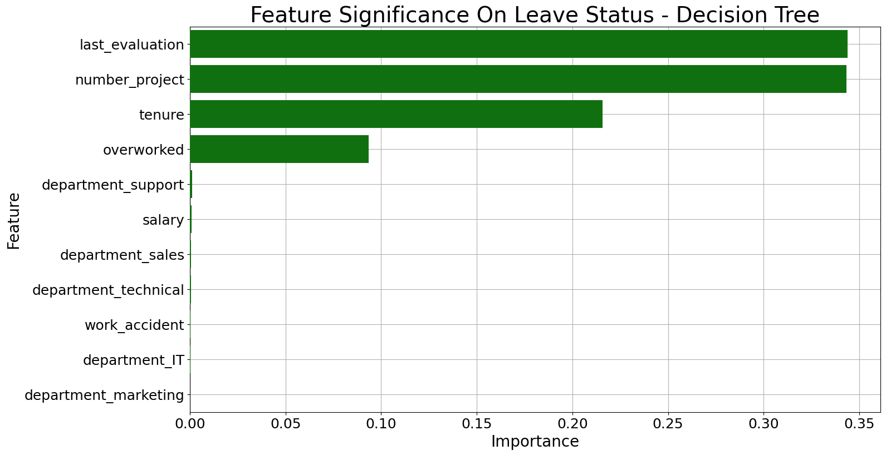
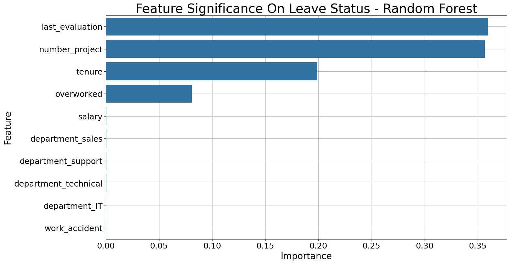

# Predicting Employee Turnover Using Tree-Based Models

## Project Overview

This project aims to address employee turnover by identifying key factors that contribute to an employee's decision to leave the company. Using employee data, we built models to predict turnover and provide insights into the most influential factors affecting retention. Among the models tested, a Random Forest classifier outperformed a Decision Tree and Logistic Regression in accuracy and reliability, making it the optimal choice for this problem.

## Business Understanding

### Stakeholder: HR Team
A company faces challenges in retaining employees, with turnover negatively impacting productivity and increasing hiring costs. The HR team is interested in understanding the factors driving turnover to make targeted interventions that will improve retention rates. By identifying at-risk employees and understanding the reasons behind their departure, the HR team can implement strategies to enhance employee satisfaction and reduce turnover.

## Data Understanding

The dataset includes employee information such as:
- Last evaluation score
- Number of projects handled
- Tenure (years)
- Status of being overworked (working more than 200 hours/month)
- Satisfaction levels and other factors

The data spans over several years, providing a comprehensive view of employee behavior and turnover trends. Some limitations include potential biases in the evaluation scores and gaps in data regarding employee sentiments. The data required careful preprocessing to ensure that missing values and outliers did not skew the model's performance.

### Exploratory Data Analysis (EDA)
Key findings from the EDA include:
- Employees with low satisfaction scores or who handle a high number of projects have a higher likelihood of leaving.
- A significant turnover rate is observed among employees with over four years of tenure.
- High last evaluation scores often correlate with overwork, indicating that high performance may come at the cost of work-life balance.

## Modeling and Evaluation

We implemented three models for predicting employee turnover:
- **Logistic Regression**: A simple baseline model that provides interpretability but struggled with capturing non-linear relationships in the data.
- **Decision Tree**: Offered better insights into feature importance but tended to overfit the training data.
- **Random Forest**: Demonstrated superior accuracy and generalization capabilities, with the following performance metrics:
  - **Accuracy**: 84%
  - **Precision**: 82%
  - **Recall**: 78%

Both tree-based models identified key factors influencing turnover, including last evaluation scores, the number of projects handled, tenure and overworked status.

## Conclusion

The Random Forest model provides valuable insights into predicting employee turnover at the company. Key recommendations include:
- **Limit the number of projects assigned to employees** to avoid burnout.
- **Promote employees with at least four years of tenure** or investigate potential dissatisfaction among this group.
- **Adjust overtime policies** to compensate employees for longer hours or reduce the expectation for overtime.
- **Improve communication** around expectations, workload and time-off policies.
- **Foster a balanced performance evaluation process** that rewards both effort and contribution, not just long hours.

### Future Work
- Further analysis of employee sentiment through surveys or feedback to understand dissatisfaction.
- Exploration of additional models like Gradient Boosting Machines (GBM) for potentially better performance.
- Implementing a real-time dashboard to track turnover probabilities and allow HR to take proactive measures.
